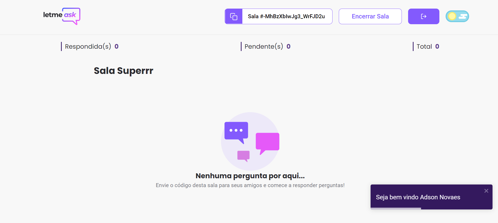
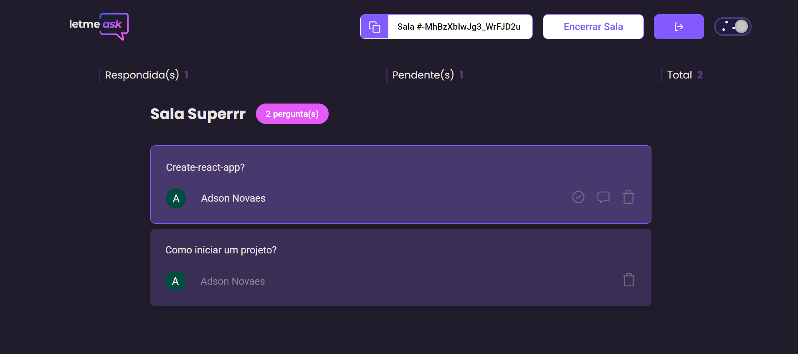

<p align="center">
  
</p>

<h1 align="center">
    
</h1>
 
<br>

## 🧪 Technologies

This project was developed using the following technologies:

- [React](https://reactjs.org)
- [Firebase](https://firebase.google.com/)
- [TypeScript](https://www.typescriptlang.org/)

## 🚀 Getting started

Clone the project and access the folder.

```bash
$ git clone https://github.com/adsonnovaes/Letmeask.git
$ cd Letmeask
```

Follow the steps below:
```bash
# Install the dependencies
$ yarn

# Start the project
$ yarn start
```
The app will be available for access on your browser at http://localhost:3000

## ⚡ Exchange of Themes

The project has the theme change, allowing the choice between the light theme and the dark theme, saving the user's preference:

### Light Theme
<h1 align="center">
    
</h1>

### Dark Theme
<p align="center">
    
</p>